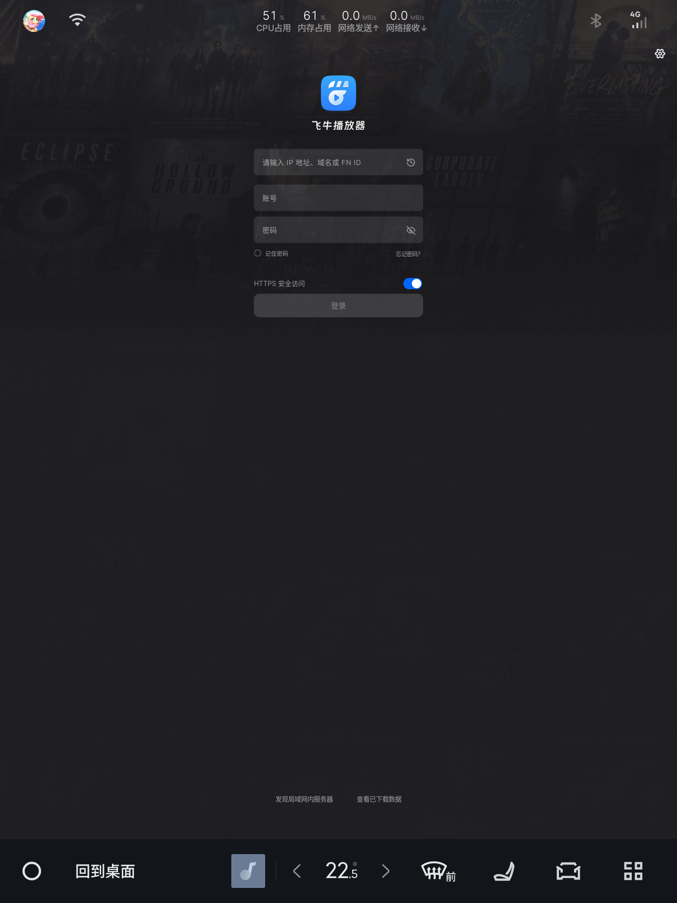
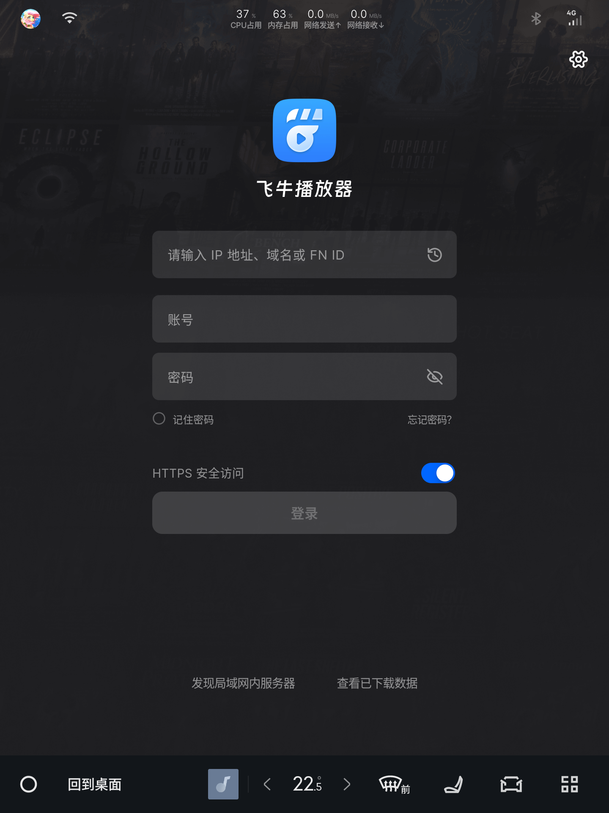
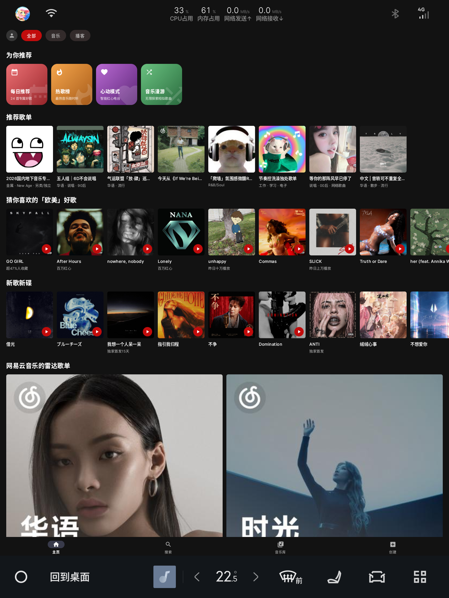
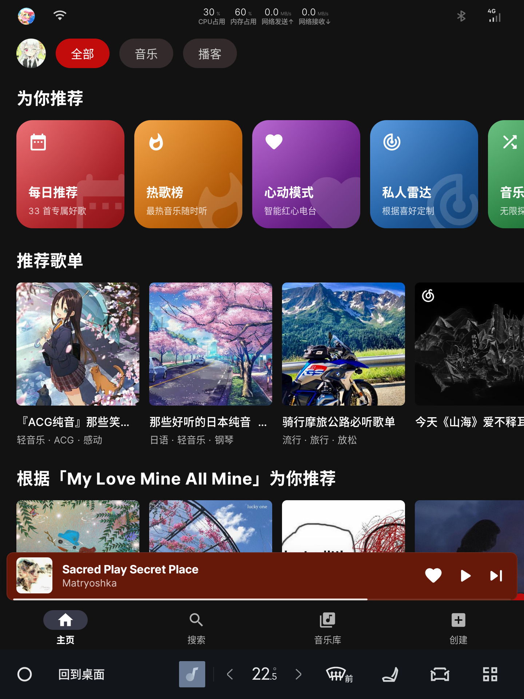

<div align="center">
  

为车机、手表与方屏设备调整应用显示密度的 Android 工具


[](CHANGELOG.md)
[](https://developer.android.com)
[](https://kotlinlang.org)
[](https://developer.android.com/jetpack/compose)
[](LICENSE)
</div>

---

## 这是什么

车机、手表与方屏设备常会错误上报屏幕密度，使第三方应用被系统按手机屏幕排版，
界面仅占屏幕中间一块，或显示为一条细竖条。

**DPI 工坊**是一个在设备本地运行的 APK 注入工具。选择目标 APK 并设定最小宽度后，
应用会在设备上直接生成显示密度已调整好的成品 APK，全程无需电脑，也无需借助
MT 管理器手动修改安装包。

界面使用 **Miuix 风格**构建，基于 Jetpack Compose；注入引擎与参数体系沿用上游实现。

---

## 功能

### 注入

- 选择目标 APK → 设定最小宽度 → 生成已注入的成品 APK，全程离线
- 常用宽度一键套用（320 / 400 / 480 / 560 / 640 / 720 / 840）
- **推荐注入配置**：依据引导中设定的本机显示尺寸自动推荐最小宽度
- 预设、参数与注入记录均保存在本地，可随时复用
- 支持通过系统分享导出成品 APK

### 本机显示尺寸

车机常将屏幕密度上报为 160 dpi，使 1440 px 的屏幕被视为 1440 dp 宽，界面元素因此偏小。
DPI 工坊自身同样受此影响，因此提供以下设置：

- **首次打开进入三步引导**：欢迎 → 界面显示尺寸 → 一切就绪；拖动滑块时实时预览，
  调整至合适大小后再进入主页
- 可随时在「设置 → 本机显示尺寸」中修改，二级页面带独立转场动画
- 可选择「跟随系统」，不作任何处理

原理与模块修改 `densityDpi` 一致：`density = 屏幕像素宽 ÷ 期望的 dp 宽`，
通过 Compose 的 `LocalDensity` 覆盖实现，无需重建 Activity。

### 屏幕信息

主页列出设备上的每一块屏幕（分辨率、dpi、物理尺寸）。进入任意屏幕的二级菜单可执行：

| 操作 | 说明 |
| --- | --- |
| **显示** | 在该屏幕上弹出大号标识，用于确认屏幕身份 |
| **截图** | 截图并保存至下载目录（root → 无障碍服务 → 提示授权，三级兜底） |
| **重命名** | 自定义屏幕名称，例如将「副屏」改为「横屏」 |

截图文件名格式：`DPI工坊-<屏幕名>-<时间>_<前台应用名>.png`。

### 保存当前环境

「设置 → 保存当前环境」会打包一个 zip 存至**下载目录**，便于反馈问题时直接提供：

| 文件 | 内容 |
| --- | --- |
| `环境信息.txt` | 屏幕数量、各屏分辨率 / dpi / dp / 物理尺寸、当前应用所在屏幕、本机尺寸设置、当前注入参数与生成的 config.xml |
| `截图.png` | 当前应用界面截图 |
| `配置.json` | 预设、历史记录与参数的完整备份 |
| `日志.txt` | 本次运行的注入日志 |

### 车机适配

车机系统自带的文件选择器（DocumentsUI）常被裁剪，调用时容易崩溃，因此
「选择目标 APK」与「保存成品 APK」均改用**应用内置的文件浏览器**：

- 默认打开下载文件夹，仅列出文件夹与 `.apk`
- 提供「上一级 / 下载 / 存储根目录」快捷跳转
- 保存成品时可自定义导出目录
- 保留「用系统文件选择器」作为备选
- 首次进入时引导授予「所有文件访问」权限（Android 11 及以上）

---

## 效果对比

同一应用在车机主屏上的显示效果，每组左侧为注入前，右侧为注入后。

<div align="center">
  
  
</div>

<div align="center">
  
  
</div>

---

## 截图预览

<div align="center">
  
  
  
  
  
  
</div>

---

## 下载与反馈

- **安装包**：前往本仓库的 [Releases](https://github.com/201SAndvic/dpi-studio/releases) 页面下载最新 APK
- **问题与建议**：欢迎提交 [Issue](https://github.com/201SAndvic/dpi-studio/issues)；
  附上「设置 → 保存当前环境」生成的 zip 将有助于定位问题
- **源码**：本仓库，欢迎 Star、Fork 与 PR

> 安装新版本无需卸载旧版。`applicationId` 保持 `com.appconfig.injector` 不变，
> 可直接覆盖安装并保留原有数据。

---

## 项目结构

```text
app/src/main/java/com/appconfig/injector/
├── MainActivity.kt              入口：初始化 + 挂载 Compose
├── Injector.java                释放内置模块 → 写配置 → 调 LSPatch → 自检 → 导出
├── ApkRewriter.java             替换模块 APK 里的 assets/config.xml
├── Config.java                  一次注入的全部参数
├── ModuleConfig.java            生成 app_config 用的 config.xml
├── Prefs.java                   参数 / 预设 / 历史记录的持久化
├── Logs.java                    全局日志（内存 + 落盘）
├── DeviceInfo.java              设备与屏幕信息采集
├── IdentifyActivity.kt          在指定屏幕上弹出大号标识
├── CaptureService.kt            无障碍截图服务
│
└── ui/                          Miuix 风格界面层
    ├── App.kt                   脚手架：路由 + 转场动画 + 返回键接管 + 文件选择 / 保存
    ├── AppState.kt              界面状态容器
    ├── Widgets.kt               卡片、信息行、确认弹窗等公共组件
    ├── Messages.kt              自绘提示条（1.5 秒）
    ├── HomeScreen.kt            主页：屏幕信息 + 设备信息
    ├── InjectScreen.kt          注入页：目标、尺寸、预设、高级参数、选项
    ├── HistoryScreen.kt         记录页
    ├── SettingsScreen.kt        设置页：本机尺寸、环境快照、日志、备份恢复、关于
    ├── AboutScreen.kt           关于页
    ├── SelfSize.kt              引导向导 + 本机显示尺寸设置
    ├── FilePickerScreen.kt      内置文件浏览器（APK / 任意文件 / 目录 三种模式）
    ├── Storage.kt               存储权限、下载目录、目录列举
    ├── EnvSnapshot.kt           环境快照：多屏信息 + 截图 → zip → 下载目录
    └── theme/AppTheme.kt        Miuix 主题

app/src/main/assets/            内置引擎：模块 APK、LSPatch dex / so、密钥库
app/libs/lspatch-classes.jar    LSPatch 引擎类（去掉 assets 的纯类包）
dev/                            开发辅助脚本：模拟器 / 编译安装 / 截图
```

---

## 构建与开发

| 项目 | 版本 |
| --- | --- |
| JDK | 21（推荐 Eclipse Temurin） |
| Gradle | 9.7.1（项目内置 Wrapper） |
| Android Gradle Plugin | 9.4.1 |
| Kotlin | 2.4.20（AGP 9 内置） |
| compileSdk / targetSdk | 37 |
| minSdk | 26（Android 8.0） |
| IDE | Android Studio 2026.1 或更高版本 |

---

## 第三方组件与许可

本项目整体以 GPL-3.0 发布，原因是内置了以 GPL-3.0 授权的 LSPatch 引擎。
详细清单与说明见 [THIRD-PARTY.md](THIRD-PARTY.md)。

| 组件 | 用途 | 许可 |
| --- | --- | --- |
| [JingMatrix/LSPatch](https://github.com/JingMatrix/LSPatch) | 注入引擎（`app/libs`、`app/src/main/assets/lspatch`） | GPL-3.0 |
| [jiwangyihao/app_config](https://github.com/jiwangyihao/app_config) | 内置注入模块（`app/src/main/assets/module.apk`） | MPL-2.0 |
| [compose-miuix-ui/miuix](https://github.com/compose-miuix-ui/miuix) | 界面组件库 | Apache-2.0 |
| Jetpack Compose / AndroidX | 界面框架 | Apache-2.0 |
| [YukiHookAPI](https://github.com/HighCapable/YukiHookAPI) | 模块 Hook 框架（随模块 APK 一起分发） | Apache-2.0 |

---

## 致谢

- [jiwangyihao/app_config](https://github.com/jiwangyihao/app_config) —— 内置注入模块，参数体系与 Hook 逻辑来自该项目
- [JingMatrix/LSPatch](https://github.com/JingMatrix/LSPatch) —— 注入引擎
- [compose-miuix-ui/miuix](https://github.com/compose-miuix-ui/miuix) —— Compose 组件库

---

## 免责声明

1. 本项目仅供个人学习、研究与技术交流使用，不得用于任何商业用途。
2. 注入或修改第三方应用可能违反该应用的服务条款，请在操作前自行确认并承担相应后果。
3. 请仅对自己拥有合法使用权的应用进行操作，请勿修改或分发他人的付费应用。
4. 使用本工具产生的一切后果由使用者自行承担，作者不对任何直接或间接损失负责。
5. 本项目与 LSPatch、app_config 及各被注入应用的开发者均无隶属关系。
