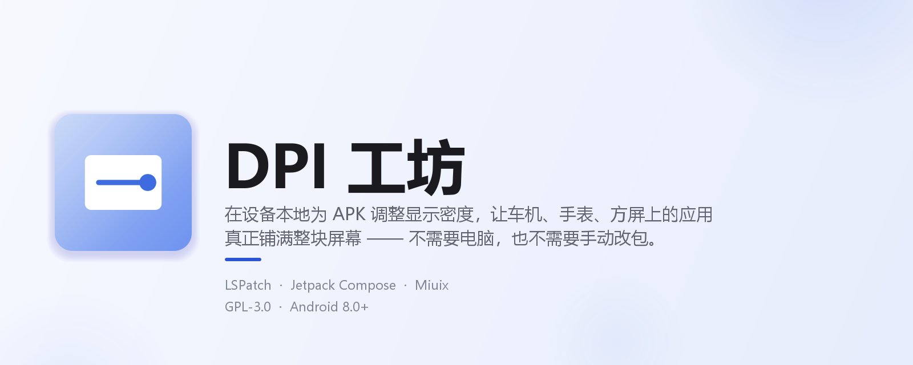
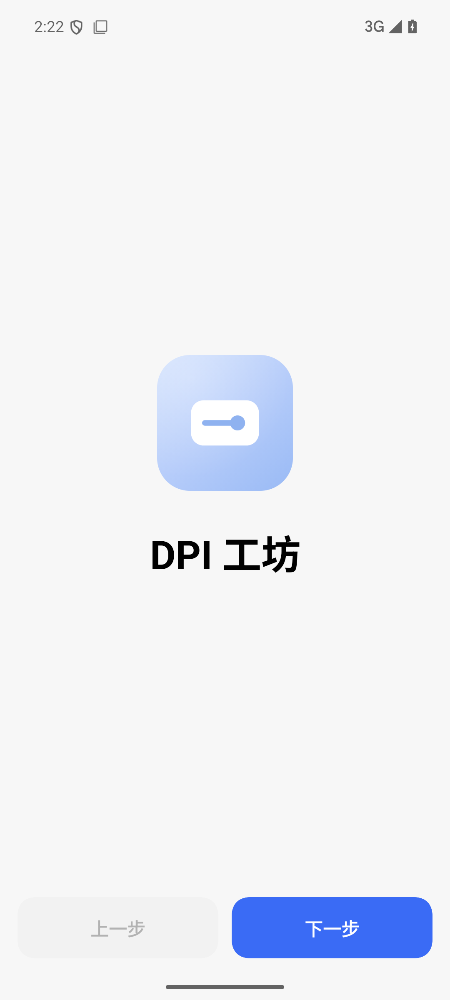
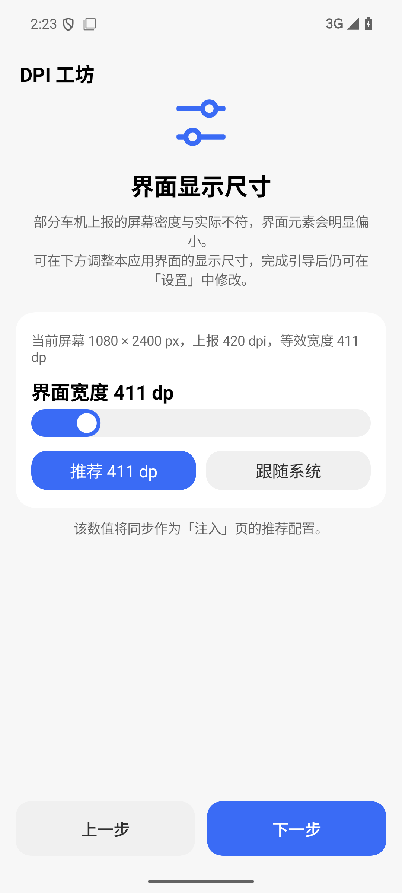
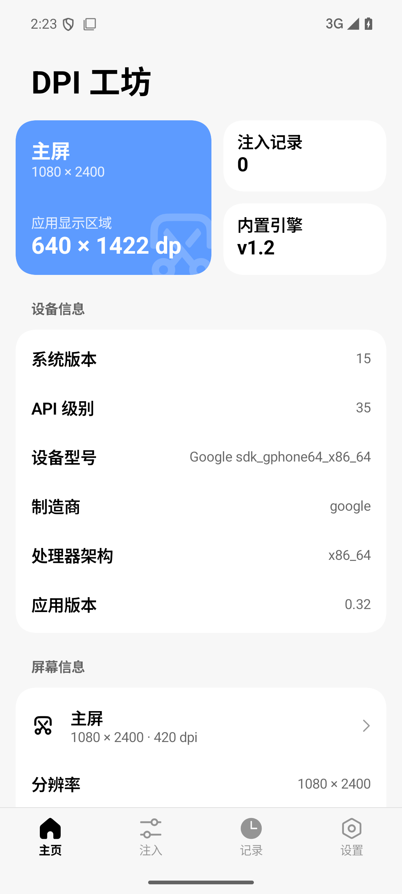
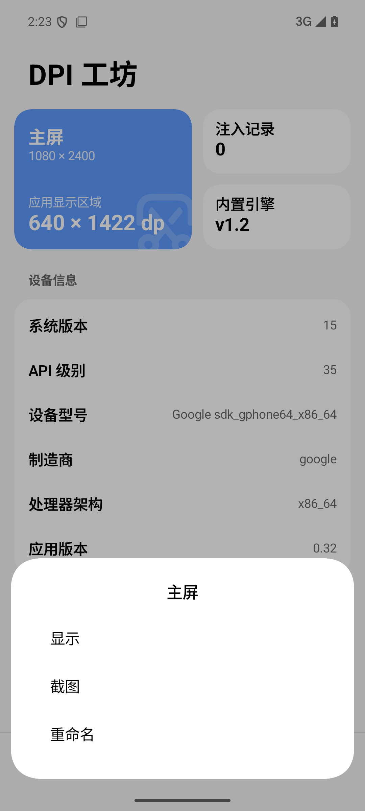
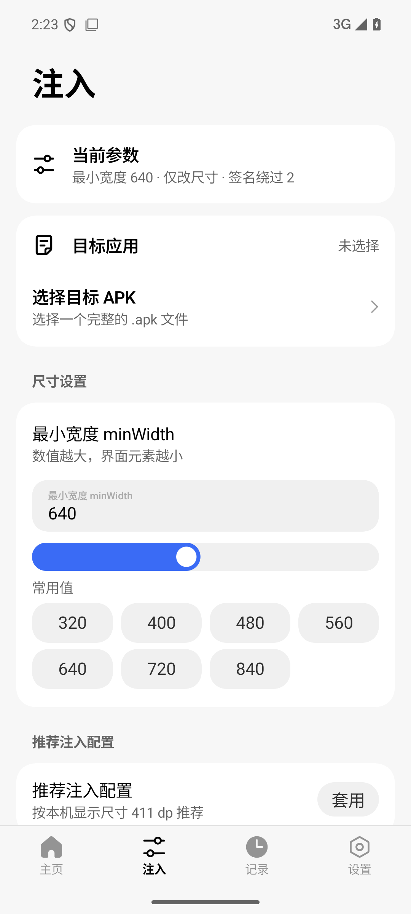
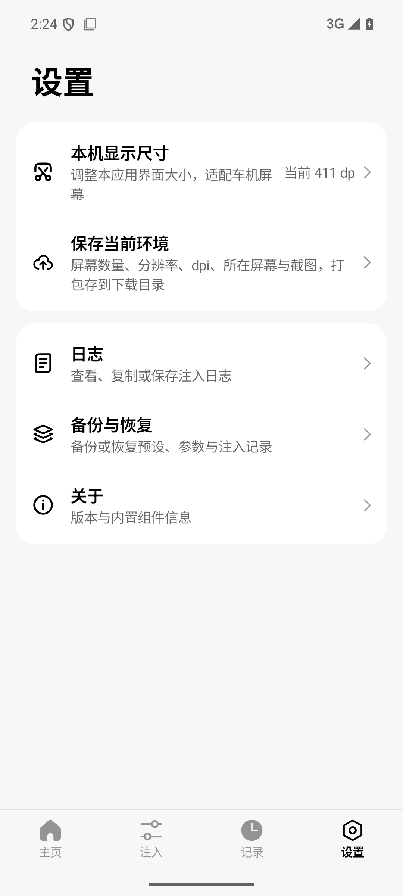

<div align="center">
  

为车机、手表与方屏设备调整应用显示密度的 Android 工具


[](CHANGELOG.md)
[](https://developer.android.com)
[](https://kotlinlang.org)
[](https://developer.android.com/jetpack/compose)
[](LICENSE)
</div>

---

## 这是什么

很多车机、手表、方屏设备会把屏幕密度报错，导致第三方应用被系统当成「手机屏」来排版 ——
界面只占屏幕中间一小块，或者只显示成一条细竖条。

**DPI 工坊**是一个跑在设备本地的 APK 注入工具：选一个 APK，设好最小宽度，点一下开始，
它就会在手机上直接生成一个已经改好密度的成品 APK。整个过程不需要电脑，也不需要
MT 管理器手动改包。

界面使用 **Miuix**（小米 HyperOS 风格）配合 Jetpack Compose 重写，参数体系与注入引擎
沿用经过长期验证的实现。

---

## 截图预览

<div align="center">
  
  
  
  
  
  
</div>

---

## 功能

### 注入

- 选择目标 APK → 设置最小宽度 → 生成已注入的成品 APK，全程离线
- 常用宽度一键套用（320 / 400 / 480 / 560 / 640 / 720 / 840）
- **推荐注入配置**：按你在引导里设定的本机显示尺寸自动推荐一个最小宽度
- 预设、参数与注入记录都会本地保存，随时复用
- 可直接调用系统分享把成品 APK 发出去

### 本机显示尺寸

车机经常把屏幕报成 160 dpi，于是 1440px 的屏幕被当成 1440dp 宽，应用界面小得看不清。
DPI 工坊自己也会遇到这个问题，因此：

- **首次打开走三步引导**：欢迎 → 界面显示尺寸 → 一切就绪，
  边拖滑块边实时预览，调到合适大小再进入主页
- 设置里可随时修改（设置 → 本机显示尺寸），二级页面带独立转场动画
- 可以选「跟随系统」完全不做处理

原理与模块改 `densityDpi` 一致：`density = 屏幕像素宽 ÷ 期望的 dp 宽`，
通过 Compose 的 `LocalDensity` 覆盖实现，不需要重建 Activity。

### 屏幕信息

主页会列出设备上每一块屏幕（分辨率、dpi、物理尺寸）。点进任意一块屏的二级菜单可以：

| 操作 | 说明 |
| --- | --- |
| **显示** | 在该屏幕上弹出大号标识，用来确认对应的是哪块屏 |
| **截图** | 截图并保存到下载目录（root → 无障碍服务 → 提示授权，三级兜底） |
| **重命名** | 给屏幕起个名字，比如把「副屏」改成「横屏」 |

截图文件名格式为 `DPI工坊-<屏幕名>-<时间>_<前台应用名>.png`。

### 保存当前环境

设置 → 保存当前环境，会打包一个 zip 存到**下载目录**，方便反馈问题时直接发出来：

| 文件 | 内容 |
| --- | --- |
| `环境信息.txt` | 屏幕数量、每块屏的分辨率 / dpi / dp / 物理尺寸、当前应用在哪块屏、本机尺寸设置、当前注入参数与生成的 config.xml |
| `截图.png` | 当前应用界面截图 |
| `配置.json` | 预设、历史记录、参数的完整备份 |
| `日志.txt` | 本次运行的注入日志 |

### 车机适配

车机上系统自带的文件选择器（DocumentsUI）经常被裁掉，一调用就崩溃。因此
「选择目标 APK」和「保存成品 APK」都换成了**应用内置的文件浏览器**：

- 默认打开下载文件夹，只列文件夹和 `.apk`
- 有「上一级 / 下载 / 存储根目录」快捷跳转
- 保存时可以自定义导出到哪个目录
- 底下保留「用系统文件选择器」作为兜底
- 需要「所有文件访问」权限（Android 11+），第一次进去会引导授权

---

## 下载与反馈

- **安装包**：前往本仓库的 [Releases](https://github.com/201SAndvic/dpi-studio/releases) 页面下载最新的 APK
- **问题与建议**：欢迎提交 [Issue](https://github.com/201SAndvic/dpi-studio/issues)，附上「设置 → 保存当前环境」生成的 zip 会很有帮助
- **源码**：本仓库。欢迎 Star、Fork 与 PR

> 安装新版本前**不需要**卸载旧版。`applicationId` 保持 `com.appconfig.injector` 不变，
> 可以直接覆盖安装并保留原有数据。

---

## 工作原理

```text
选择目标 APK
      │
      ▼
释放内置的 LSPatch 引擎与注入模块（assets/lspatch、assets/module.apk）
      │
      ▼
把当前参数写成 config.xml，替换进模块 APK 的 assets/config.xml
      │
      ▼
调用 LSPatch 完成注入与会话签名
      │
      ▼
自检生成的 APK（能否解析、模块是否就位）
      │
      ▼
导出成品 APK
```

其中有一个**很容易踩的坑**，这里特别说明：模块是用 `ZipInputStream` +
`zipEntry.size` 读取 `assets/config.xml` 的。Java 的 `ZipOutputStream` 默认会为
DEFLATED 项写「数据描述符」，局部头里的 size 是 `-1`，模块就会 `new byte[-1]`
抛异常，然后悄悄退回代码内置的默认值（`forceRound = true`、`roundSize = 1.0`、
`roundRatio = 1.0`），结果是界面被裁成屏幕的 `1/√2`，也就是**只剩中间一块**。

所以 `ApkRewriter` 替换这一项时强制使用 STORED 模式，并把 size 与 CRC 提前写进
局部头。修复前后，读到的 size 从 `-1` 变成了正确的字节数。

---

## 项目结构

```text
app/src/main/java/com/appconfig/injector/
├── MainActivity.kt              入口：初始化 + 挂载 Compose
├── Injector.java                释放内置模块 → 写配置 → 调 LSPatch → 自检 → 导出
├── ApkRewriter.java             替换模块 APK 里的 assets/config.xml（见「工作原理」）
├── Config.java                  一次注入的全部参数
├── ModuleConfig.java            生成 app_config 用的 config.xml
├── Prefs.java                   参数 / 预设 / 历史记录的持久化
├── Logs.java                    全局日志（内存 + 落盘）
├── DeviceInfo.java              设备与屏幕信息采集
├── IdentifyActivity.kt          在指定屏幕上弹出大号标识
├── CaptureService.kt            无障碍截图服务
│
└── ui/                          Miuix 风格界面层
    ├── App.kt                   脚手架：路由 + 转场动画 + 返回键接管 + 文件选择 / 保存
    ├── AppState.kt              界面状态容器
    ├── Widgets.kt               卡片、信息行、确认弹窗等公共组件
    ├── Messages.kt              自绘提示条（1.5 秒）
    ├── HomeScreen.kt            主页：屏幕信息 + 设备信息
    ├── InjectScreen.kt          注入页：目标、尺寸、预设、高级参数、选项
    ├── HistoryScreen.kt         记录页
    ├── SettingsScreen.kt        设置页：本机尺寸、环境快照、日志、备份恢复、关于
    ├── AboutScreen.kt           关于页
    ├── SelfSize.kt              引导向导 + 本机显示尺寸设置
    ├── FilePickerScreen.kt      内置文件浏览器（APK / 任意文件 / 目录 三种模式）
    ├── Storage.kt               存储权限、下载目录、目录列举
    ├── EnvSnapshot.kt           环境快照：多屏信息 + 截图 → zip → 下载目录
    └── theme/AppTheme.kt        Miuix 主题

app/src/main/assets/            内置引擎：模块 APK、LSPatch dex / so、密钥库
app/libs/lspatch-classes.jar    LSPatch 引擎类（去掉 assets 的纯类包）
dev/                            一键脚本：开模拟器 / 编译安装 / 截图
```

---

## 应用图标

自适应图标（`mipmap-anydpi-v26/ic_launcher.xml`），全部是矢量，任意分辨率都不糊：

- **背景**：浅蓝到靛青的对角渐变，左上叠一层柔光
- **前景**：一块「屏幕」外框，里面是一条带滑块的调节轨道 —— 屏幕 + 滑块 = 调整显示
- **monochrome**：同形状的单色版，供 Android 13+ 主题图标使用

---

## 构建与开发

### 环境要求

| 项目 | 版本 |
| --- | --- |
| JDK | 21（推荐 Eclipse Temurin） |
| Gradle | 9.7.1（项目内置 Wrapper，直接 `gradlew`） |
| Android Gradle Plugin | 9.4.1 |
| Kotlin | 2.4.20（**AGP 9 内置，不要再单独应用 `org.jetbrains.kotlin.android`**） |
| compileSdk / targetSdk | 37 |
| minSdk | 26（Android 8.0） |
| IDE | Android Studio 2026.1 或更高版本 |

### 常用命令

```bash
./gradlew assembleDebug      # 调试包
./gradlew assembleRelease    # 正式包
```

产物在 `app/build/outputs/apk/`。用 Android Studio 直接打开本目录也能构建，
SDK 路径读 `local.properties`（可参考 `local.properties.example`）。

### 一键脚本（Windows，`dev` 目录）

| 脚本 | 作用 |
| --- | --- |
| `dev\启动模拟器.cmd` | 打开带界面的模拟器（默认 AVD `phone`） |
| `dev\编译并装到模拟器.cmd` | 编译 → 安装 → 自动打开应用 |
| `dev\截图.cmd` | 把当前模拟器画面存到 `shots\` |

### 签名

签名材料从版本控制外部注入（读 `local.properties`）。**没有配置正式签名时会自动
回退成 Debug 签名**，因此任何人 clone 下来都能编译出可安装的 APK。

想打正式包请参阅 [RELEASE_SIGNING.md](RELEASE_SIGNING.md)。

### 两个容易踩的坑

1. **不要再加 `org.jetbrains.kotlin.android` 插件**，AGP 9 已内置 Kotlin，重复应用会直接报错。
2. **Gradle 必须是 9.x**，AGP 8.x 与 Gradle 9.6+ 不兼容，项目已锁定 Wrapper 9.7.1。

---

## 版本规则

版本号永远不到 `1.0`，按下面两种方式递进（见 [CHANGELOG.md](CHANGELOG.md)）：

| 类型 | 规则 | 例子 |
| --- | --- | --- |
| **大改**（加功能、改结构） | 第二位 +1，并开一个新的小改序列 | `0.1` → **`0.2`** → `0.21` → `0.22` → **`0.3`** |
| **小改**（修问题、微调） | 在小改序列里递增 | `0.1` → **`0.11`** → **`0.12`** → `0.13` |

改版本只动一处：`app/build.gradle.kts` 里的 `versionName` 与 `versionCode`。

> 当前的 **1.0** 是开源首发的里程碑版本，同时也是版本号规则里的上限。
> 之后的小改建议在 1.0 系列里递增（`1.01`、`1.02`…），保持「永不超过 1.0」这条规则。

---

## 第三方组件与许可

本项目**整体以 GPL-3.0 发布**，原因是内置了以 GPL-3.0 授权的 LSPatch 引擎。
详细清单与说明见 [THIRD-PARTY.md](THIRD-PARTY.md)。

| 组件 | 用途 | 许可 |
| --- | --- | --- |
| [JingMatrix/LSPatch](https://github.com/JingMatrix/LSPatch) | 注入引擎（`app/libs`、`app/src/main/assets/lspatch`） | GPL-3.0 |
| [jiwangyihao/app_config](https://github.com/jiwangyihao/app_config) | 内置注入模块（`app/src/main/assets/module.apk`） | MPL-2.0 |
| [compose-miuix-ui/miuix](https://github.com/compose-miuix-ui/miuix) | 界面组件库 | Apache-2.0 |
| Jetpack Compose / AndroidX | 界面框架 | Apache-2.0 |
| [YukiHookAPI](https://github.com/HighCapable/YukiHookAPI) | 模块 Hook 框架（随模块 APK 一起分发） | Apache-2.0 |

---

## 非常感谢

- [jiwangyihao/app_config](https://github.com/jiwangyihao/app_config) —— 本项目内置的注入模块，整个参数体系与 Hook 逻辑都来自这里
- [JingMatrix/LSPatch](https://github.com/JingMatrix/LSPatch) —— 提供注入引擎
- [compose-miuix-ui/miuix](https://github.com/compose-miuix-ui/miuix) —— 提供 HyperOS 风格的 Compose 组件
- [HighCapable/YukiHookAPI](https://github.com/HighCapable/YukiHookAPI) —— 模块侧的 Hook 框架
- [rinchao0721/Melodia](https://github.com/rinchao0721/Melodia) —— 本仓库 README 与开源组织方式的参考

---

## 免责声明

1. 本项目仅供个人学习、研究与技术交流使用，不得用于任何商业用途。
2. 注入、修改第三方应用可能违反该应用的服务条款，请在操作前自行确认并承担相应后果。
3. 请仅对自己拥有合法使用权的应用进行操作；请勿修改、分发他人的付费应用。
4. 使用本工具产生的一切后果由使用者自行承担，作者不对任何直接或间接损失负责。
5. 本项目与小米、LSPatch、app_config 及各被注入应用的开发者均无隶属关系。
